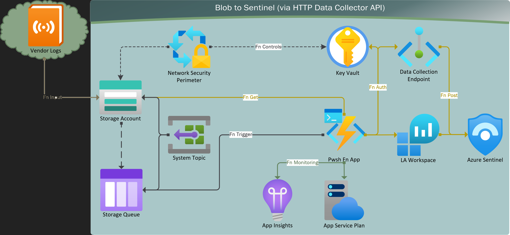

Heavily expanded rennovation/fork of
[Sreedhar Ande's Azure Storage Account Blobs Ingestion](https://github.com/sreedharande/AzureStorageAccountBlobsIngestion)

Perhaps abandoned, resumed development, or was originally a fork of official
[Azure Docs - Powershell samples](https://github.com/Azure/azure-docs-powershell-samples/blob/master/storage/post-storage-logs-to-log-analytics/PostStorageLogs2LogAnalytics.ps1)

Roots also found in [Travis Roberts' Write-OMSLogfile](https://github.com/tsrob50/LogAnalyticsAPIFunction/tree/master)

[Official Azure docs](https://learn.microsoft.com/en-us/previous-versions/azure/azure-monitor/logs/data-collector-api?tabs=powershell#sample-requests) recommend hardcoding secrets?

# Azure Sentinel Blob Log Lobber
This custom Azure Sentinel Data connector ingests Azure Storage Account Blobs to Azure Sentinel via pwsh function app.



## **Pre-requisites**
1. Write a [Log Analytics Workspace Table](https://learn.microsoft.com/en-us/azure/azure-monitor/logs/create-custom-table?tabs=azure-powershell-1%2Cazure-portal-2%2Cazure-portal-3) into the target Sentinel Workspace that fits the schema of the logs being ingested. If either schema or sample log json available, can quick import as custom table in LA Workspace. Data Collection Rule (and maybe DC Endpoint) are currently optional, though required for a self-managed custom table. **Note** The original implementation is based on the Azure Monitor API which requires the table is classic/MMA based table, and each LA Workspace has a max cap on them. Creating a schema is not required for the old Analytics API, which just regexp's a table schema based on what's being sent to it. Work in progress from here is converting to DCR-based table/ingestion model, though the intent is to support the old model until it dies.

2. Click on Deploy to Azure (For both Commercial & Azure GOV)
[](https://portal.azure.com/#create/Microsoft.Template/uri/https%3A%2F%2Fraw.githubusercontent.com%2FMfMpEng%2FAzureSentinelBlobLogLobber%2Frefs%2Fheads%2Fmain%2Fazuredeploy.json)

3. Select the preferred **Subscription**, **Resource Group** and **Location**
   **Note**
   Best practice : Create new Resource Group
   Suggestion    : ```<<Function App Name>>-rg```

4. Enter the following value in the ARM template deployment
	```
	"Function App Name"    : Describe datasource only - Deployment labels accordingly.
	"LA Table Name"        : Custom LA Table fitting schema of log source.
	"Workspace Resource Id": Log Analytics Resource Id​  (JSON View -> Copy)
	"Workspace Id"         : Log Analytics Workspace Id​ (customerId in the above json view)
	"Workspace Key"        : Log Analytics Workspace Key
	```

## Details
1. This ARM template creates an Azure Storage Account Blob Container called ```<<functionAppName>>-2Blob```. Send source logs here.
2. Powershell Function App orchestrates ingestion by polling Storage Queue blob write messages written by an Event Grid Subscription Topic.
3. Fn App sanitizes/processes blob json/gzip; upon successful LA Workspace REST response then deletes the local and SA Blob, and Queue Msg.
