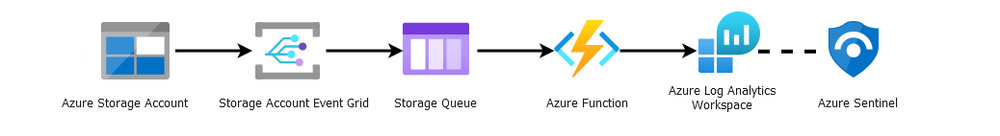
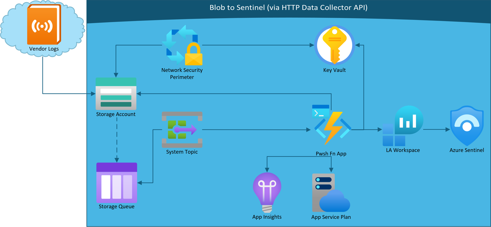

More templated 4-year revamp, and totally untested, unhinged fork of [Sreedhar Ande's AzureStorageAccountBlobsIngestion](https://github.com/sreedharande/AzureStorageAccountBlobsIngestion)


# Storage Account Blobs to Azure Sentinel
This custom Azure Sentinel Data connector ingests Azure Storage Account Blobs to Azure Sentinel via powershell function app.



## **Pre-requisites**

1. Click on Deploy to Azure (For both Commercial & Azure GOV)
[](https://portal.azure.com/#create/Microsoft.Template/uri/https%3A%2F%2Fraw.githubusercontent.com%2FMfMpEng%2FAzureStorageAccountBlobsIngestion%2Frefs%2Fheads%2Fmain%2Fazuredeploy.json)

2. Select the preferred **Subscription**, **Resource Group** and **Location**
   **Note**
   Best practice : Create new Resource Group while deploying - all the resources of your custom Data connector will reside in the newly created Resource
   Suggestion    : ```<<Function App Name>>-rg```

3. Enter the following value in the ARM template deployment
	```
	"Function App Name"    : Describe datasource only - Template labels resources accordingly.
	"LA Table Name"        : Custom log table that fits the schema of the incoming log source.
	"Workspace Resource Id": Azure Log Analytics Resource Id​  (View json -> Copy)
	"Workspace Id"         : Azure Log Analytics Workspace Id​ (in the above string)
	"Workspace Key"        : Azure Log Analytics Workspace Key
	```

## Details
1. Write a Log Analytics Workspace table into the target Sentinel that fits the schema of the logs being ingested. Vendor may have json available to quickly convert into ARM format.
2. This package creates an Azure Storage Account called ```<<Function App Name>>-sa``` and ```<<functionAppName>>-2Blob``` Container. Send source logs here.
3. Function app is a persistent powershell env orchestrating ingestion based on Event Grid Subscription to SA writes, triggering log ingestion procedure on Container Blobs.

5. PROFIT!!!